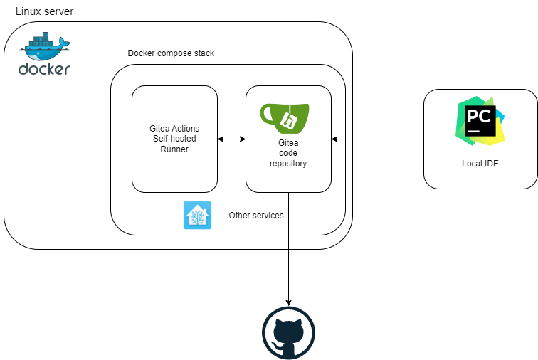

# Docker compose CI/CD


## Setup
The following steps are to be executed on the same server the docker compose stack is meant to run on. It assumes
its a linux machine with an ssh server running.

1) Use `docker compose up -d gitea` to start Gitea
2) browse to the new Gitea instance and go through initial setup.
3) Since Gitea Actions are still in preview: Enable actions in Gitea's `app.ini` ([see link](https://blog.gitea.io/2022/12/feature-preview-gitea-actions/)) 
and restart Gitea.
```
    # custom/conf/app.ini
    [actions]
    ENABLED = true
```
4) Create a new repo in Gitea. Note: Name the base branch `main` or update the workflows accordingly.
5) Go to the repo's setting in Gitea, check the box: 'Enable Repository Actions' and save.
6) Go to Site Administration -> Runners -> Create new runner and get a runner registration token. 
7) Replace the variables in `docker-compose.yml` or set them as environment variables: 
- `${RUNNER_TOKEN}`
- `${GITEA_IP}` (e.g. 192.168.2.1)
- `${PATH_TO_THIS_REPO}` (e.g. '~/deployment_pipeline')
- `${REPO_NAME}` (e.g. Bob/deployment_pipeline)
8) Add your SSH key to Gitea [example guide](https://www.techaddressed.com/tutorials/add-verify-ssh-keys-gitea/). 
Note: Make sure it doesn't have a passphrase and [permissions are set correctly](https://stackoverflow.com/questions/9270734/ssh-permissions-are-too-open).
9) Run `docker compose up -d gitea_act` to start the actions runner.

Optional:
10) Set Github (or other) as mirror for Gitea repo.

## Usage
In your development environment, set Gitea as the remote for your repo.
Commit and push your work, and watch the Gitea Actions do the rest of the work!

## TODO / IDEAS
- Could maybe try and get a runner token from Gitea by itself?
- Test the schedule workflow once its released.
- The runner registration token only works once, so if you have to rebuild, you have to refresh 
the token. Maybe there is a solution for this?